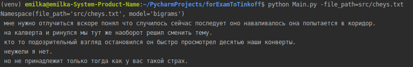
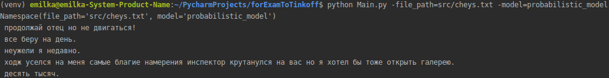

# Tinkoff
## Запуск:
    1. Переходим в консоли в forExamToTinkoff
    2. Вводим команду: python Main.py
## Аргументы:
    Путь до обучающего файла:
    1) -file_path <путь относительно файла Main.py c расширением файла>
        По умолчанию стоит src/cheys.txt
    2) -model <название модели>
        Доступно два типа моделей:
            1. bigrams
            2. probabilistic_model
        По умолчанию стоит bigrams
## Описание:
    Я привел реализации 2 моделей:
    1) Первая модель - биграмная c запоминанием 1 cледующего слова.
    Вероятнее всего, было бы неплохо сделать запоминание 3-4 последующих слов.
    Но на это не хватило времени
    
    2) Вторая модель - на основе наиболее вероятного следующего слова.
    Идет высчет, какое слово, вероятнее всего, встретися после последнего выведенного.
    Думаю, что в данном случае тоже можно увеличить точность, увеличив количество созраняемых
    слова (увеличить последовательность слов)
    
    Кажется, вторая модель работет более точно
    
    btw: Попробовал сделать расстановку запятых (запоминание,
    после какого слова, обычно, идет запятая).
    Работает плохо, явно надо смотреть на то слово, которое идет после запятой.
    Реализовать не сложно, но тоже на это не хватает времени
## Пример запуска программы:
    python Main.py -file_path src/open.txt -model probabilistic_model
    ИЛИ
    python Main.py -file_path=src/open.txt -model=probabilistic_model
## Пример
Вывод bigram модели

Вывод probabilistic_model модели

    